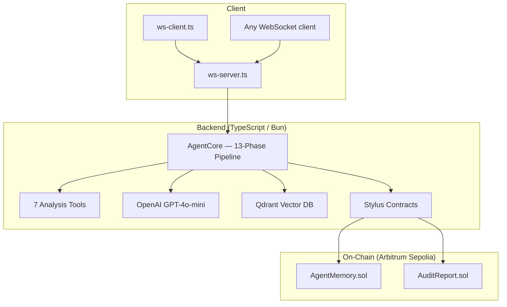

# RAXC — Autonomous Exploit Intelligence Core

> **AI-powered DeFi smart contract vulnerability scanner using RAG (Retrieval-Augmented Generation) with on-chain audit proof on Arbitrum Sepolia.**

[](./backend-typescript)
[](./stylus)
[](./backend-typescript/Dockerfile)

---

## Architecture



---

## How It Works — 13-Phase Pipeline

```
Phase 0  → Load on-chain memory (past audits from Arbitrum Sepolia)
Phase 1  → Dispatch 7 analysis tools in parallel
Phase 2  → Normalize tool signals (filter noise, enforce precision)
Phase 3  → Multi-agent reasoning (convert signals to agent votes)
Phase 4  → Consensus engine (weighted voting aggregation)
Phase 5  → Risk intelligence scoring (severity × confidence × agreement)
Phase 6  → Attack simulation (VM-like execution path generation)
Phase 7  → Graph construction (deterministic attack DAG)
Phase 8  → Consistency verification (4-way gatekeeper)
Phase 9  → Final decision (SINGLE AUTHORITY — no override)
Phase 10 → Attestation proof (cryptographic replay ID + trace hash)
Phase 11 → LLM explanation (GPT-4o-mini, constrained to 2-3 sentences)
Phase 12 → Markdown report + on-chain storage (Stylus)
```

### 7 Analysis Tools

| Tool | Detects | Trust Weight |
|---|---|---|
| `RaxcAnalyzerRemote` | RAG-based exploit matching (Qdrant + OpenAI) | 1.0x |
| `PatternDetectorTool` | Reentrancy, delegatecall, tx.origin, overflow | 0.8x |
| `FlashLoanTool` | Flash loan callbacks, spot price oracles | 0.7x |
| `AccessControlTool` | Missing `onlyOwner`, unprotected initializers | 0.7x |
| `ReflectionTool` | LLM self-critique (CONFIRMED/REDUCED/REJECTED) | 0.7x |
| `MemoryTool` | Past audit recall from on-chain storage | 0.7x |
| `GasAnalyzerTool` | Gas optimizations (non-security) | 0.2x |

---

## On-Chain Contracts (Stylus / Rust)

### `AgentMemory` — Long-Context Memory

Stores JSON audit summaries on Arbitrum Sepolia for persistent agent memory.

```solidity
function pushMemory(uint256 tokenId, bytes summaryJson, string description)
function getMemoryData(uint256 tokenId, uint256 index) → bytes
function memoryCount(uint256 tokenId) → uint256
```

### `AuditReport` — Immutable Audit Trail

Stores full markdown security reports on-chain with cryptographic hashing.

```solidity
function createAudit(string contractName) → uint256 taskId
function finalizeAudit(uint256 taskId, uint8 riskLevel, uint64 confidence,
                        string vulnType, bytes reportMarkdown)
function getReport(uint256 taskId) → bytes
function recordCount() → uint256
```

Risk levels: `0=None | 1=Low | 2=Medium | 3=High | 4=Critical`

---

## Project Structure

```
raxclaw-arbitrum/
├── stylus/                    # Stylus contracts (Rust → WASM → Arbitrum)
│   ├── src/
│   │   ├── agent_memory.rs   # AgentMemory contract
│   │   └── audit_report.rs   # AuditReport contract
│   └── Cargo.toml
│
├── backend-typescript/        # WebSocket server + agent framework
│   ├── src/
│   │   ├── agent.ts           # AgentCore, 13 engines, ReportEngine
│   │   ├── tools.ts           # 7 analysis tools
│   │   ├── openai-client.ts   # GPT-4o-mini interface
│   │   ├── qdrant-storage.ts  # Qdrant HNSW vector search
│   │   ├── stylus-client.ts   # viem-based Stylus contract client
│   │   ├── index.ts           # Embedding + RAG pipeline
│   │   └── bin/
│   │       ├── ws-server.ts   # WebSocket server (Hono + Bun)
│   │       └── ws-client.ts   # WebSocket CLI client
│   ├── examples/
│   │   └── agent-example.ts   # Standalone CLI example
│   ├── Dockerfile
│   ├── docker-compose.yml
│   └── .env.example
│
└── backend/                   # [Legacy] Original Rust backend
```

---

## Quick Start

### Prerequisites

- [Bun](https://bun.sh) ≥ 1.2
- [Docker](https://docker.com) (optional, for deployment)
- API keys: OpenAI, Qdrant Cloud
- Arbitrum Sepolia wallet with ETH (for on-chain proofs)

### 1. Configure Environment

```bash
cd backend-typescript
cp .env.example .env
# Edit .env with your keys
```

### 2. Run Locally

```bash
# Install deps
bun install

# Standalone CLI analysis
bun run examples/agent-example.ts

# Start WebSocket server
bun run src/bin/ws-server.ts

# Connect with client (separate terminal)
bun run src/bin/ws-client.ts
```

### 3. Docker Deployment

```bash
docker compose up -d          # Start server
docker compose logs -f         # Tail logs
curl localhost:3001/health     # Health check
docker compose down            # Stop
```

### 4. WebSocket API

```bash
# Connect
wscat -c ws://localhost:3001/ws

# Send contract for analysis
> {"contract": "pragma solidity ^0.8.0; contract Foo { ... }"}

# Server streams phase-by-phase progress, then returns final result
```

### Response Format (Server → Client)

| Message Type | Description |
|---|---|
| `banner` | Welcome/header box |
| `info` | Phase progress (connection, tools, decisions) |
| `progress` | Real-time detail lines (tree format) |
| `explanation` | LLM-generated vulnerability explanation |
| `complete` | Final summary with on-chain tx hashes |
| `error` | Error message |

---

## Technology Stack

| Layer | Technology |
|---|---|
| **Backend runtime** | [Bun](https://bun.sh) |
| **WebSocket server** | [Hono](https://hono.dev) |
| **LLM** | OpenAI GPT-4o-mini |
| **Embeddings** | OpenAI text-embedding-3-small (1536d) |
| **Vector DB** | Qdrant Cloud (HNSW) |
| **Blockchain** | Arbitrum Sepolia |
| **Contracts** | Stylus (Rust → WASM) |
| **On-chain client** | viem |
| **Container** | Docker (Alpine + Bun) |

---

## Secrets Management

`.env` is git-ignored. `.env.example` is safe to commit. Required variables:

```
OPENAI_API_KEY        # https://platform.openai.com/api-keys
QDRANT_ENDPOINT       # https://cloud.qdrant.io
QDRANT_API_KEY        # Qdrant Cloud API key
ARBITRUM_SEPOLIA      # RPC endpoint
PRIVATE_KEY           # Wallet with Sepolia ETH
AGENT_MEMORY          # Deployed contract address
AUDIT_REPORT          # Deployed contract address
```

---

## License

MIT © RAXC Team
