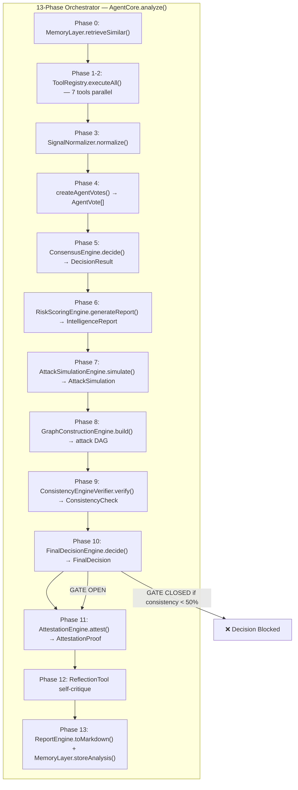

# RAXC — Autonomous Exploit Intelligence Core

> **AI-powered DeFi smart contract vulnerability scanner using RAG (Retrieval-Augmented Generation) with on-chain audit proof on Arbitrum Sepolia.**

[](./backend)
[](./stylus)
[](./backend/Dockerfile)
[](https://raxclaw-arbitrum.fly.dev)
[](https://raxclaw-arbitrum.vercel.app)

---

## 🔗 Live Deployments

| Service | URL |
|---|---|
| **Frontend** | [raxclaw-arbitrum.vercel.app](https://raxclaw-arbitrum.vercel.app) |
| **WebSocket API** | `wss://raxclaw-arbitrum.fly.dev/ws` |
| **AgentMemory** | [0xa56b7ebf77b8cb70ed7f276f1c9fb19d98ddc3c1](https://sepolia.arbiscan.io/address/0xa56b7ebf77b8cb70ed7f276f1c9fb19d98ddc3c1) |
| **AuditReport** | [0xb30dfe68645217fcba0f29b4cdc515ef558422e2](https://sepolia.arbiscan.io/address/0xb30dfe68645217fcba0f29b4cdc515ef558422e2) |

### 🔐 Latest On-Chain Proof

| Field | Link |
|---|---|
| **AgentMemory TX** | [0x516354789ac7090f6e65f8b4fee3424c34ea38aaf87300fafdb3ec4165711e20](https://sepolia.arbiscan.io/tx/0x516354789ac7090f6e65f8b4fee3424c34ea38aaf87300fafdb3ec4165711e20) |
| **AuditReport TX** | [0x65ce22f4a49a75e6544675cbe0ab969da25830f0234e0d03cf0a05db68a8b740](https://sepolia.arbiscan.io/tx/0x65ce22f4a49a75e6544675cbe0ab969da25830f0234e0d03cf0a05db68a8b740) |
| **Full Report** | [raxclaw-arbitrum.vercel.app/tx-report/0x65ce22f4a49a75e6544675cbe0ab969da25830f0234e0d03cf0a05db68a8b740](https://raxclaw-arbitrum.vercel.app/tx-report/0x65ce22f4a49a75e6544675cbe0ab969da25830f0234e0d03cf0a05db68a8b740) |

---

## Architecture

```
┌─────────────────────────────────────────────────────────────────────┐
│                        raxclaw CLI (Ink/React)                      │
│            run │ analyze │ list │ show │ agent │ health             │
└─────────────────────────────────┬───────────────────────────────────┘
                                  │ spawns
                                  ▼
┌─────────────────────────────────────────────────────────────────────┐
│                      skills/raxc-security/run.sh                    │
│               (all env baked in — zero-config for users)            │
└─────────────────────────────────┬───────────────────────────────────┘
                                  │ exec
                                  ▼
┌─────────────────────────────────────────────────────────────────────┐
│              backend/examples/agent-example.ts                      │
│                  RAXC Cognition Engine (TypeScript)                 │
│                                                                     │
│  1. loadEnv()              Load baked config                        │
│  2. QdrantStorageClient    Query 782 exploits via HNSW (<10ms)      │
│  3. buildOpenAiClient()    OpenAI GPT-4o-mini endpoint              │
│  4. AgentCore::new()       Assemble multi-tool agent                │
│     ├─ RaxcAnalyzer        RAG semantic similarity                  │
│     ├─ RaxcAnalyzerRemote  Secondary RAG confirmation               │
│     ├─ PatternDetectorTool CEI / reentrancy patterns                │
│     ├─ GasAnalyzerTool     Gas griefing vectors                     │
│     ├─ FlashLoanTool       Flash loan attack paths                  │
│     ├─ AccessControlTool   Owner / role checks                      │
│     ├─ ReflectionTool      Self-review loop (OpenAI critique)       │
│     └─ MemoryTool          Persistent cognition memory              │
│  5. Parallel execution     All 8 tools run concurrently             │
│  6. SignalNormalizer       Filter noise, lock precision             │
│  7. ConsensusEngine        Weighted multi-agent voting              │
│  8. AttackSimulationEngine VM-like exploit execution                │
│  9. GraphConstructionEngine Deterministic attack DAG                │
│  10. ConsistencyEngine     Gatekeeper — blocks invalid decisions    │
│  11. ConfidenceEngine      SINGLE SOURCE OF TRUTH                   │
│  12. FinalDecisionEngine   SINGLE AUTHORITY — no LLM override       │
│  13. AttestationEngine     Cryptographic replay ID + trace hash     │
│  14. MemoryLayer           Store result to Stylus contracts on-chain│
└─────────────────────────────────┬───────────────────────────────────┘
                                  │
              ┌───────────────────┴──────────────────────┐
              ▼                                          ▼
┌───────────────────────────────┐   ┌─────────────────────────────────┐
│      Arbitrum Sepolia         │   │          Qdrant Cloud           │
│         (Chain 421614)        │   │  (782 exploits, 2 collections)  │
│                               │   │                                 │
│      AgentMemory (Stylus)     │   │      HNSW-indexed search        │
│   0xa56b7ebf... Token-based   │   │       cosine similarity         │
│                               │   │                                 │
│      AuditReport (Stylus)     │   │  defi_cases + defi_protocols    │
│   0xb30dfe68... Task-based    │   │      68fe2ddf.cloud.qdrant      │
└───────────────────────────────┘   └─────────────────────────────────┘
```

---

## How It Works — 13-Phase Pipeline

```
Phase 0  → Load on-chain memory (past audits from Arbitrum Sepolia)
Phase 1  → Dispatch 7 analysis tools in parallel
Phase 2  → Normalize tool signals (filter noise, enforce precision)
Phase 3  → Multi-agent reasoning (convert signals to agent votes)
Phase 4  → Consensus engine (weighted voting aggregation)
Phase 5  → Risk intelligence scoring (severity × confidence × agreement)
Phase 6  → Attack simulation (VM-like execution path generation)
Phase 7  → Graph construction (deterministic attack DAG)
Phase 8  → Consistency verification (4-way gatekeeper)
Phase 9  → Final decision (SINGLE AUTHORITY — no override)
Phase 10 → Attestation proof (cryptographic replay ID + trace hash)
Phase 11 → LLM explanation (GPT-4o-mini, constrained to 2-3 sentences)
Phase 12 → Markdown report + on-chain storage (Stylus)
```

### 7 Analysis Tools

| Tool | Detects | Trust Weight |
|---|---|---|
| `RaxcAnalyzerRemote` | RAG-based exploit matching (Qdrant + OpenAI) | 1.0x |
| `PatternDetectorTool` | Reentrancy, delegatecall, tx.origin, overflow | 0.8x |
| `FlashLoanTool` | Flash loan callbacks, spot price oracles | 0.7x |
| `AccessControlTool` | Missing `onlyOwner`, unprotected initializers | 0.7x |
| `ReflectionTool` | LLM self-critique (CONFIRMED/REDUCED/REJECTED) | 0.7x |
| `MemoryTool` | Past audit recall from on-chain storage | 0.7x |
| `GasAnalyzerTool` | Gas optimizations (non-security) | 0.2x |

---

## Orchestrator Engine Architecture

RAXC is built as a **deterministic multi-agent orchestrator** — every component is a specialized engine that feeds into the next, forming a single verifiable audit pipeline with no LLM override.



### Core Classes (agent.ts — 2,016 lines)

| Class | Role | Key Method |
|---|---|---|
| `ToolRegistry` | Pluggable tool system | `register()` / `executeAll()` |
| `SignalNormalizer` | Filters noise, locks precision | `normalize()` / `lockConfidence()` |
| `SeverityLock` | Deterministic severity mapping | `enforce()` |
| `ConsensusEngine` | Weighted multi-agent voting | `decide()` → `DecisionResult` |
| `RiskScoringEngine` | Risk formula: 0.35×severity + 0.25×confidence + 0.2×agreement + 0.2×similarity | `calculate()` / `generateReport()` |
| `AttackSimulationEngine` | 4 simulation types (Reentrancy, AccessControl, FlashLoan, Generic) | `simulate()` |
| `GraphConstructionEngine` | Deterministic attack DAG | `build()` |
| `ConsistencyEngineVerifier` | **4-way gatekeeper** — blocks invalid decisions | `verify()` → `ConsistencyCheck` |
| `ConfidenceEngine` | **SINGLE SOURCE OF TRUTH** for confidence | `calculate()` |
| `FinalDecisionEngine` | **SINGLE AUTHORITY** — no LLM/tool override | `decide()` → `FinalDecision` |
| `AttestationEngine` | Cryptographic proof + replay | `attest()` → `AttestationProof` |
| `ReportEngine` | Markdown with 17 standardized sections | `toMarkdown()` |
| `MemoryLayer` | On-chain Stylus persistence | `storeAnalysis()` / `retrieveSimilar()` |
| `AgentCore` | **13-phase orchestration** | `analyze()` |

### Key Interfaces

| Interface | Purpose |
|---|---|
| `Tool` | Contract for pluggable analysis tools: `name()` + `execute()` |
| `ToolSignal` | Structured ground truth: `vulnerability`, `severity`, `confidence`, `evidence` |
| `AgentVote` | Multi-agent vote: `agentName`, `vulnerability`, `confidence`, `reasoning` |
| `DecisionResult` | Consensus output: `vulnerabilityFound`, `primaryVulnerability`, `riskLevel`, `confidence` |
| `IntelligenceReport` | Risk scoring output: `riskScore`, `exploitabilityScore`, `toolAgreement`, `attackLikelihood` |
| `AttackSimulation` | Complete attack model: `executionPath`, `stateTransitions`, `attackerModel`, `exploitVerdict` |
| `FinalDecision` | Single authority output: `finalVerdict`, `finalConfidence`, `finalRiskScore` |
| `AttestationProof` | Verifiable proof: `replayId`, `seed`, `executionTraceHash`, `timestamp` |
| `AnalysisResult` | Complete audit output: decision + signals + simulation + graph + attestation + markdown |

### Authority Chain

```
ToolRegistry (pluggable)      → Raw signals
        ↓
SignalNormalizer              → Filtered signals
        ↓
ConsensusEngine               → DecisionResult
        ↓
RiskScoringEngine             → IntelligenceReport
        ↓
AttackSimulationEngine        → AttackSimulation
        ↓
GraphConstructionEngine       → Attack DAG
        ↓
ConsistencyEngineVerifier     → GATEKEEPER (blocks if score < 50%)
        ↓
ConfidenceEngine              → SINGLE SOURCE OF TRUTH
        ↓
FinalDecisionEngine           → SINGLE AUTHORITY (no LLM override)
        ↓
AttestationEngine             → Cryptographic proof
        ↓
ReportEngine + MemoryLayer    → Markdown + On-chain storage
```

❌ **NO module can override `FinalDecisionEngine`** — not tools, not agents, not LLMs.  
✅ **Every execution is deterministic** — same input always produces same output, replay ID, and trace hash.

---

## On-Chain Contracts (Stylus / Rust)

### `AgentMemory` — Long-Context Memory

Stores JSON audit summaries on Arbitrum Sepolia for persistent agent memory.

```solidity
function pushMemory(uint256 tokenId, bytes summaryJson, string description)
function getMemoryData(uint256 tokenId, uint256 index) → bytes
function memoryCount(uint256 tokenId) → uint256
```

### `AuditReport` — Immutable Audit Trail

Stores full markdown security reports on-chain with cryptographic hashing.

```solidity
function createAudit(string contractName) → uint256 taskId
function finalizeAudit(uint256 taskId, uint8 riskLevel, uint64 confidence,
                        string vulnType, bytes reportMarkdown)
function getReport(uint256 taskId) → bytes
function recordCount() → uint256
```

Risk levels: `0=None | 1=Low | 2=Medium | 3=High | 4=Critical`

---

## Project Structure

```
raxclaw-arbitrum/
├── stylus/                    # Stylus contracts (Rust → WASM → Arbitrum)
│   ├── src/
│   │   ├── agent_memory.rs   # AgentMemory contract
│   │   └── audit_report.rs   # AuditReport contract
│   └── Cargo.toml
│
├── backend/                   # TypeScript WebSocket server + agent framework
│   ├── src/
│   │   ├── agent.ts           # AgentCore, 13 engines, ReportEngine (2,016 lines)
│   │   ├── tools.ts           # 7 analysis tools
│   │   ├── openai-client.ts   # GPT-4o-mini interface
│   │   ├── qdrant-storage.ts  # Qdrant HNSW vector search
│   │   ├── stylus-client.ts   # viem-based Stylus contract client
│   │   ├── index.ts           # Embedding + RAG pipeline
│   │   └── bin/
│   │       ├── ws-server.ts   # WebSocket server (Hono + Bun)
│   │       └── ws-client.ts   # WebSocket CLI client
│   ├── examples/
│   │   └── agent-example.ts   # Standalone CLI example
│   ├── Dockerfile
│   ├── docker-compose.yml
│   └── .env.example
│
├── dist/                       # Compiled CLI
│   ├── raxclaw.mjs            # 1.7MB bundled ESM
│   └── raxclaw                # Shell entry point
│
├── build.cjs                  # esbuild bundler config
├── raxclaw.tsx                # Ink/React CLI source
└── reports/                   # Generated audit reports
```

---

## Quick Start

### Prerequisites

- [Bun](https://bun.sh) ≥ 1.2
- [Docker](https://docker.com) (optional, for deployment)
- API keys: OpenAI, Qdrant Cloud
- Arbitrum Sepolia wallet with ETH (for on-chain proofs)

### 1. Configure Environment

```bash
cd backend-typescript
cp .env.example .env
# Edit .env with your keys
```

### 2. Run Locally

```bash
# Install deps
bun install

# Standalone CLI analysis
bun run examples/agent-example.ts

# Start WebSocket server
bun run src/bin/ws-server.ts

# Connect with client (separate terminal)
bun run src/bin/ws-client.ts
```

### 3. Docker Deployment

```bash
docker compose up -d          # Start server
docker compose logs -f         # Tail logs
curl localhost:3001/health     # Health check
docker compose down            # Stop
```

### 4. WebSocket API

```bash
# Connect
wscat -c ws://localhost:3001/ws

# Send contract for analysis
> {"contract": "pragma solidity ^0.8.0; contract Foo { ... }"}

# Server streams phase-by-phase progress, then returns final result
```

### Response Format (Server → Client)

| Message Type | Description |
|---|---|
| `banner` | Welcome/header box |
| `info` | Phase progress (connection, tools, decisions) |
| `progress` | Real-time detail lines (tree format) |
| `explanation` | LLM-generated vulnerability explanation |
| `complete` | Final summary with on-chain tx hashes |
| `error` | Error message |

---

## Technology Stack

| Layer | Technology |
|---|---|
| **Backend runtime** | [Bun](https://bun.sh) |
| **WebSocket server** | [Hono](https://hono.dev) |
| **LLM** | OpenAI GPT-4o-mini |
| **Embeddings** | OpenAI text-embedding-3-small (1536d) |
| **Vector DB** | Qdrant Cloud (HNSW) |
| **Blockchain** | Arbitrum Sepolia |
| **Contracts** | Stylus (Rust → WASM) |
| **On-chain client** | viem |
| **Container** | Docker (Alpine + Bun) |

---

## Secrets Management

`.env` is git-ignored. `.env.example` is safe to commit. Required variables:

```
OPENAI_API_KEY        # https://platform.openai.com/api-keys
QDRANT_ENDPOINT       # https://cloud.qdrant.io
QDRANT_API_KEY        # Qdrant Cloud API key
ARBITRUM_SEPOLIA      # RPC endpoint
PRIVATE_KEY           # Wallet with Sepolia ETH
AGENT_MEMORY          # Deployed contract address
AUDIT_REPORT          # Deployed contract address
```

---

## License

MIT © RAXC Team
